- 基于SpringBoot的旅游交流论坛
- 预览地址：[http://travel.liuyanzhao.com](http://travel.liuyanzhao.com)
- 详细介绍地址：[https://liuyanzhao.com/shop/TravelForum.html](https://liuyanzhao.com/shop/TravelForum.html)

- 新录制了讲解视频，如下图
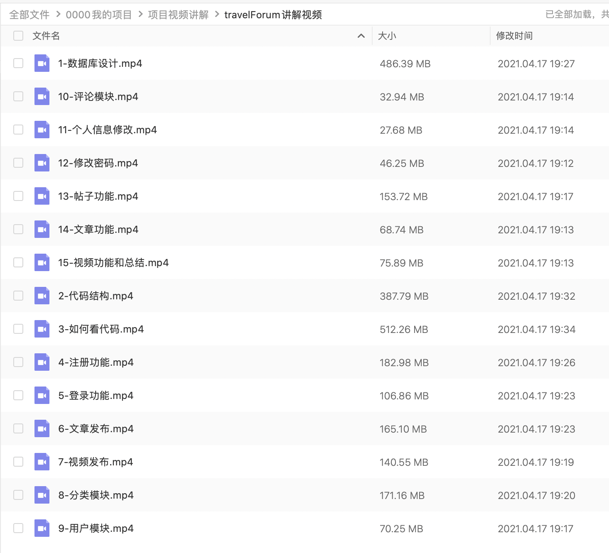

## 一、功能介绍
- 包括管理员、用户两种角色
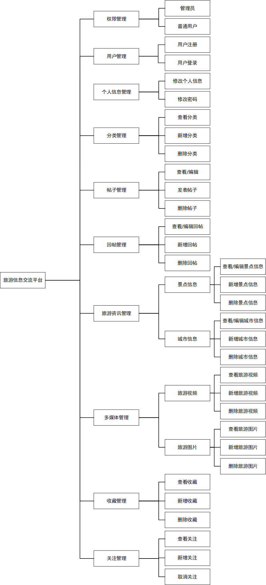

#### 用户功能如下
- 帖子管理
- 回帖管理
- 收藏管理
- 关注、粉丝管理
- 照片管理
- 视频管理
- 个人信息

#### 管理员功能如下
拥有用户的所有权限，用户只能查询自己的数据，管理员可以看全量的数据，除此之外还有以下功能
- 景点信息管理
- 城市信息管理
- 帖子分类管理
- 用户管理
- 角色管理
- 权限管理
- 以及其他所有帖子、回帖、照片、视频管理

## 二、技术组成
- 1、SpringBoot
- 2、MyBatis
- 3、Thymeleaf
- 4、Bootstrap
- 5、MySQL
- 6、Shiro

## 三、项目截图
1-首页.png

2-登录.png

3-我的收藏.png
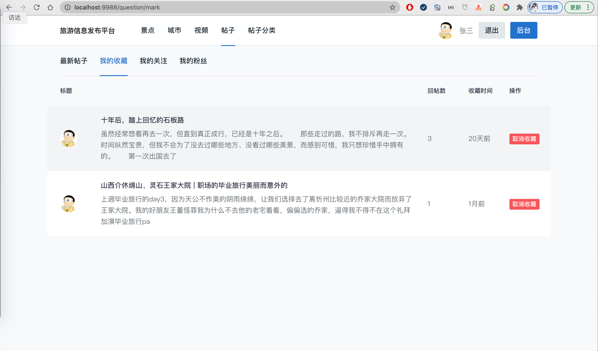
4-我的关注.png

5-我的粉丝.png
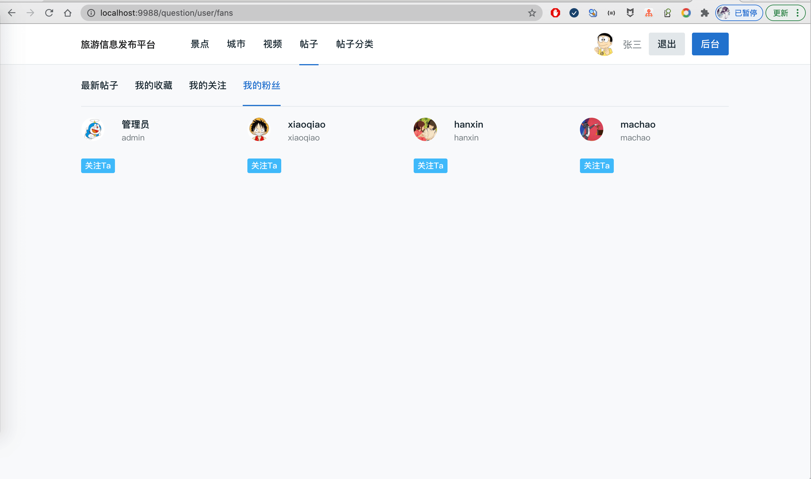
6-景点列表.png

7-城市列表.png

8-视频列表.png

9-分类列表.png
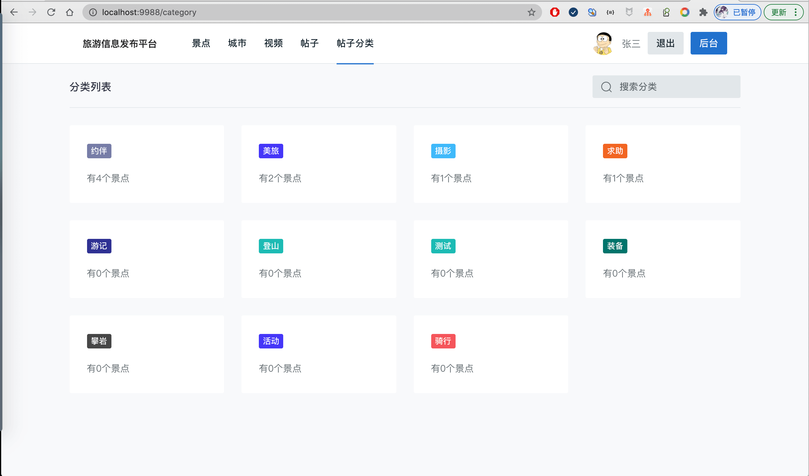
10-帖子详情.png

11-回帖功能.png
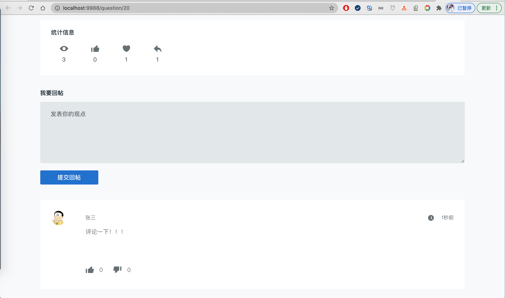
12-视频详情.png
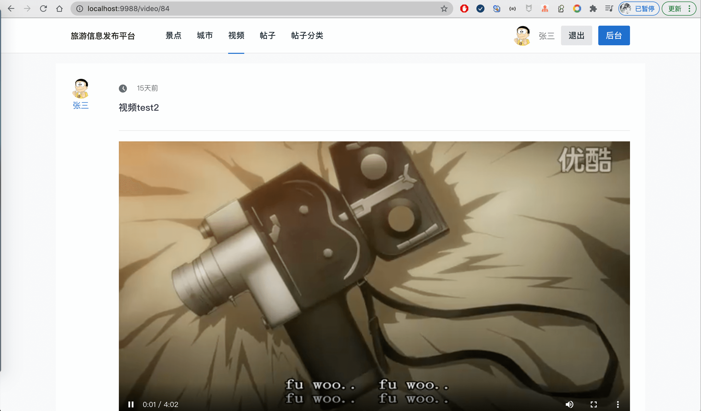
13-景点详情.png

14-帖子列表.png

15-帖子发布编辑页面.png
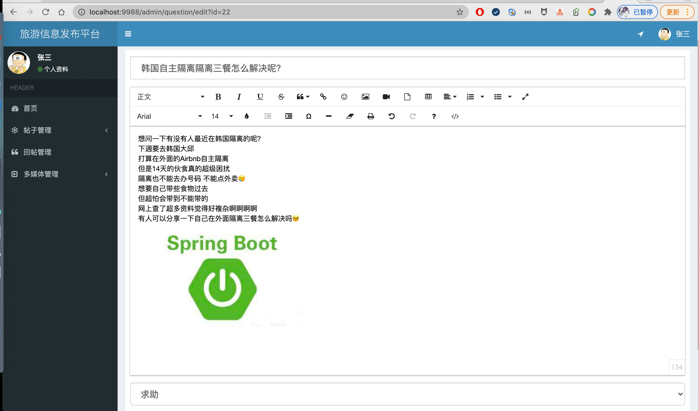
16-回帖管理.png
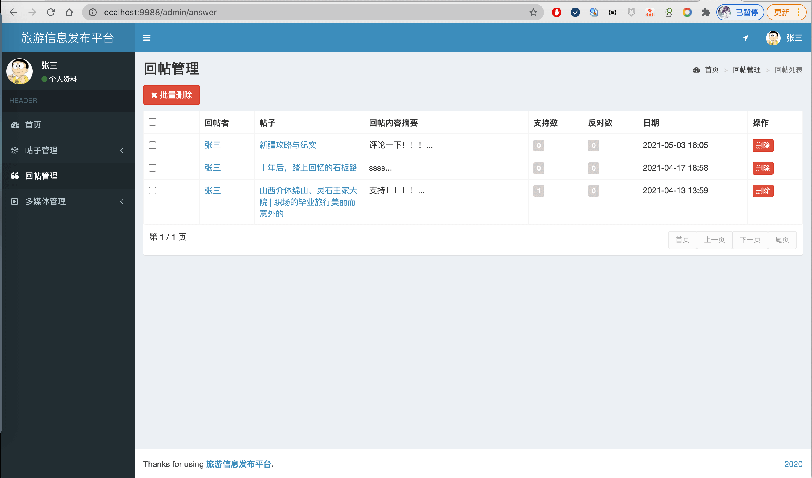
17-视频管理.png

18-图片管理.png

19-景点管理.png
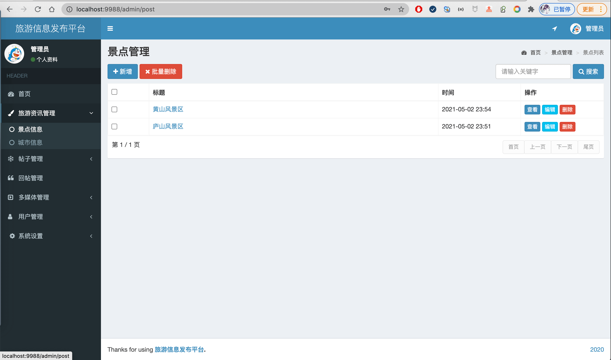
20-城市信息管理.png

21-所有帖子管理.png

22-分类管理.png
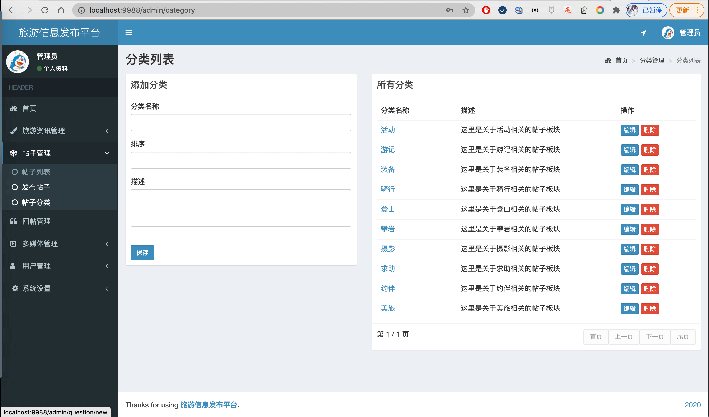
23-所有照片.png
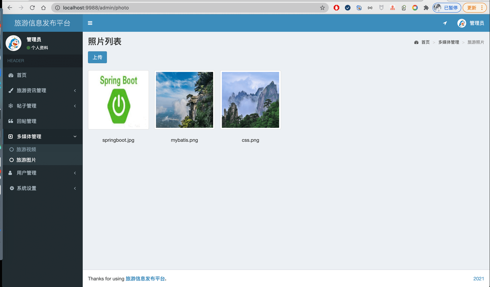
24-照片详情.png
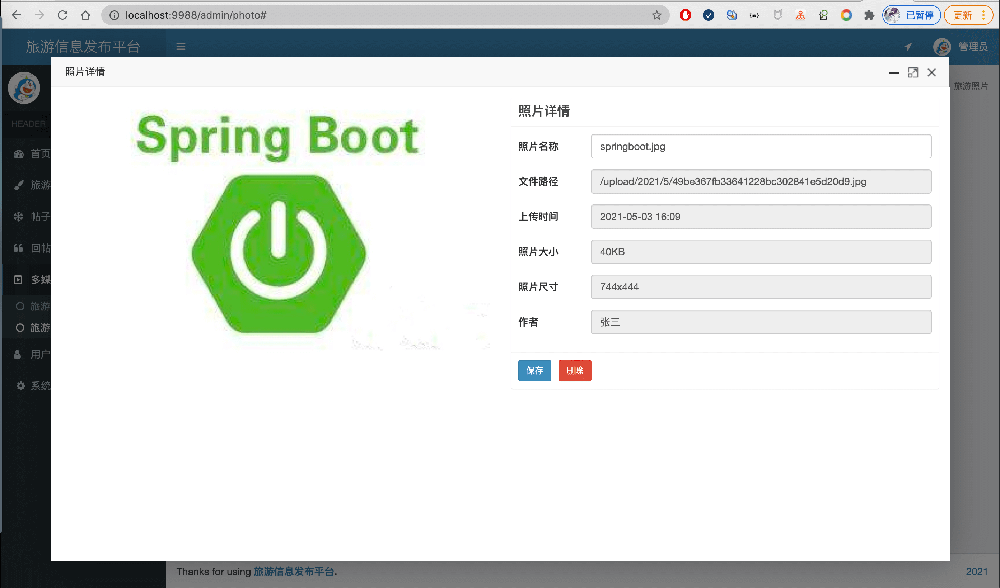
25-用户管理.png

26-角色管理.png
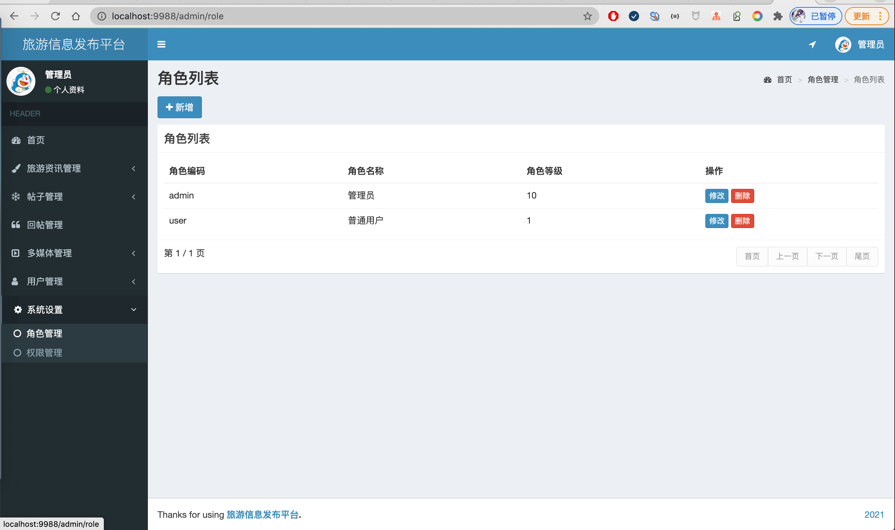
27-权限管理.png
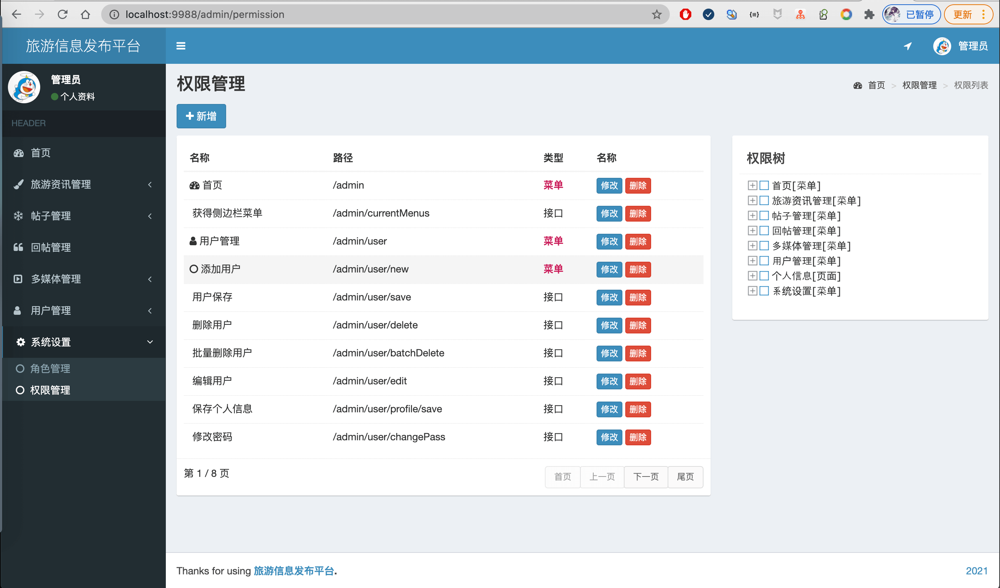
28-个人信息.png

## 四、联系方式
需要完整代码联系博主，微信847064370
赠送讲解视频

